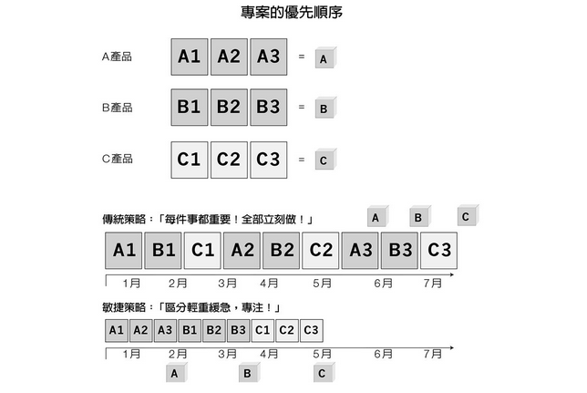
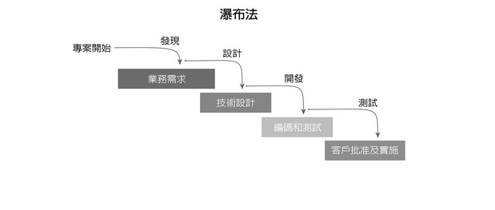
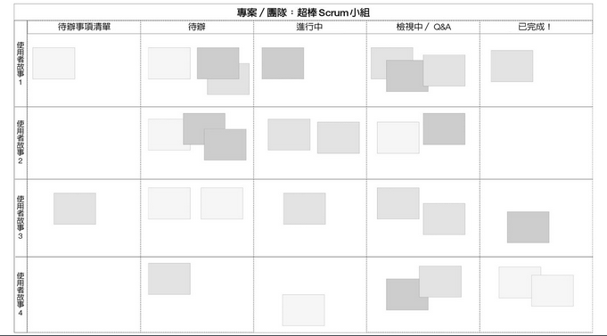

# SCRUM: The Art of Doing Twice the Work in Half the Time

- 摘要：[yucj](https://github.com/YuCJ) 
- 日期：2019.03.14

- [SCRUM: The Art of Doing Twice the Work in Half the Time](#scrum-the-art-of-doing-twice-the-work-in-half-the-time)
  - [The Philosophy behind Scrum](#the-philosophy-behind-scrum)
    - [Blame the system, not the person](#blame-the-system-not-the-person)
    - [個人表現可以解決特殊情況，但團隊制度才能有穩定產出](#個人表現可以解決特殊情況但團隊制度才能有穩定產出)
    - [轉換工作有成本，與其平行分工，不如進行集中火力](#轉換工作有成本與其平行分工不如進行集中火力)
    - [心力是寶貴資源，不要浪費時間作錯誤的事](#心力是寶貴資源不要浪費時間作錯誤的事)
    - [既然長期、瀑布式計畫被證明是無效的，就不要浪費時間作它](#既然長期瀑布式計畫被證明是無效的就不要浪費時間作它)
  - [Build a Scrum Team](#build-a-scrum-team)
    - [Scrum 團隊最適規模：3～9人](#scrum-團隊最適規模39人)
    - [Scrum 團隊的必要性質](#scrum-團隊的必要性質)
      - [透明](#透明)
      - [有追求不斷改善的熱情](#有追求不斷改善的熱情)
      - [有自主決定怎麼做事的權限](#有自主決定怎麼做事的權限)
      - [團隊本身就要有完成專案產品所需的所有技能](#團隊本身就要有完成專案產品所需的所有技能)
    - [Scrum 團隊的領導角色](#scrum-團隊的領導角色)
      - [Product Owner](#product-owner)
      - [Scrum Master](#scrum-master)
    - [Scrum 團隊怎麼跟團隊外合作](#scrum-團隊怎麼跟團隊外合作)
  - [The Overall Picture about Scrum: 不斷 sprints 創造價值](#the-overall-picture-about-scrum-不斷-sprints-創造價值)
  - [Sprint Planning](#sprint-planning)
    - [列出必須完成的 stories 清單](#列出必須完成的-stories-清單)
      - [A User Story, Not a Todo Item](#a-user-story-not-a-todo-item)
      - [The Required Properties of a GOOD STORY](#the-required-properties-of-a-good-story)
      - [Testable: Story must have Definition of Done](#testable-story-must-have-definition-of-done)
      - [Examples of Story](#examples-of-story)
    - [排定優先順序：每段衝刺都要有創造價值的成品，最確定有價值的先](#排定優先順序每段衝刺都要有創造價值的成品最確定有價值的先)
      - [排定優先順序範例](#排定優先順序範例)
    - [估算規模：用 Planning Poker 估點數](#估算規模用-planning-poker-估點數)
    - [Sprint Planning 範例](#sprint-planning-範例)
  - [Sprint Retrospective](#sprint-retrospective)
  - [Daily Standup Meeting](#daily-standup-meeting)

---

## The Philosophy behind Scrum

### Blame the system, not the person

- 當你在談論你自己時，你百分之百是對的；但是你在談論別人時，卻犯了人類最常見也最具破壞性的錯誤，那就是論斷別人的行為。甚至還有一個名詞是專門用來形容這種狀況的，就是「基本歸因錯誤」（Fundamental Attribution Error）我。們都覺得自己的行事是在因應環境，但卻覺得別人的行事是受到他們自己的個性所觸動。
- 我們絕大部分的行為都根源於四周環境的系統，而非任何既有特質。設計出Scrum的用意就是要改變這個系統。Scrum不會要大家指責別人或挑出錯誤，而是藉由促使大家集中共事與完成工作來獎勵良好的行為。
- 每個人都是自己所處制度中的生物，而Scrum的用意就在於先接受這個現實，進而檢視導致失敗的制度並予以改正，而非找一個人來譴責。

### 個人表現可以解決特殊情況，但團隊制度才能有穩定產出

- 經常仰賴英雄出手，趕在截止日期前把專案完成的團隊，就等於平常沒有依照應有的方式運作。一直在從一個危機進入下一個危機，會讓人感到精疲力盡，也無法讓人推動合理而持續的改善。兩者之間就像是牛仔騎馬出現、把女孩從壞人手中救走，以及訓練有素的海軍陸戰排把殲滅區清空的差別。

### 轉換工作有成本，與其平行分工，不如進行集中火力

- 一位名叫哈洛德．帕施樂（Harold Pashler）的科學家，在1990年代早期證明了這件事，他稱為「雙重任務的干擾」（Dual 
  Task 
  Interference）。他先要求一群受測者做一件非常簡單的事，像是在燈亮起時按下按鈕；接著他又要另一群受測者做同樣的事，但是又加上另一件簡單的任務，像是根據閃燈顏色的不同來按下不同的按鈕。在增加第二項任務後，無論任務的內容再怎麼簡單，花費的時間照樣加倍。帕施樂的推論是，其中出現了某種處理瓶頸，人們因此一次只能想一件事。他猜想，有某種程度的心力是花費在把一個程序「打包」放到記憶中，再把另一個程序拉出來執行工作。每當人們在不同任務間切換時，就是這樣的過程在耗費時間。
- 測試人員決定檢視全公司每一位「馬特」們，亦即數百名開發人員，並分析馬上修正程式缺陷所花費的時間，和幾週後才修正程式缺陷所花費的時間有何不同。不要忘了，軟體是一種頗為複雜、牽連甚廣的產物，你覺得上述兩種改正的時點所花費的時間會相差多少？
  答案是相差了二十四倍。假如在出現程式缺陷的當天就改正，或許得花一個小時；但是幾週後才改，就必須花費二十四個小時。這和缺陷是大是小、是複雜是簡單並沒有關係，只要經過幾週後，就一定得花費二十四倍的時間才能改好。
- 當你在進行某個專案時，腦中都是和它有關的東西，你很清楚之所以要做某件事的所有原因，這時你的腦子裡存在一個與之相關的複雜架構。想在幾週後重新建立這樣的架構十分困難，你必須先想起你在做決定時納入考量的所有因素，必須重新建立促使你做出該決定的思考流程，必須再度成為當時的自己，把自己拉回到已經不復存在的思維裡。做這些動作都要花費時間，而且還是很長的時間，是你在發現問題的當下就馬上把它改正的二十四倍。

- 豐田、本田及日產（Nissan）等日本車商平均花16.8個小時生產一輛豪華轎車。零件從廠房的一端送入，在約莫17個小時後就會有一輛凌志（Lexus）問世。每一百輛成品會出現34處的瑕疵，還算不壞。 但是，歐洲車商就不同了。賓士、奧迪與BMW等製造商則要花費57個小時生產一輛車，每一百輛車有78.8處的瑕疵。
  - 每當在豐田的廠房裡，生產線上出現問題時，任何工人都有權停下整條生產線。出現這種狀況時，所有人都會湧向生產線的停止點，並不是為了責罵停下生產線的人，而是為了解決任何出現的問題，他們不希望從生產線上出去的任何車輛還有必須修正的問題存在。他們只要修正一次，問題就永遠解決了
  - 歐洲的豪華轎車製造商，當時做事的方法並不同。在生產線的末端，有幾十名身穿實驗室白袍的人四處走動，解決產品的所有問題，他們負責確保車門在關上時都會發出BMW的金屬聲、引擎也能精準發出正確的音色，或是負責確保所有零件都適切地組合在一起。他們不視自己為製造人員，而以打造美麗作品的工匠或師傅自居。當生產的車輛不多時，這麼做很棒，但是在生產車輛是以百萬計時，成本就會變得更高。正如沃馬克在他書中的描述： ……德國工廠解決自己創造出來的問題所耗費的心力，比日本工廠第一次就做出幾近完美的車子需要的心力還多。
- 既有做法是，由情報機構指定目標，把實際運作交給特種部隊，特種部隊再把任何蒐集到的情報轉交給另一個小組進行分析。採用這種轉交情報做法的人發現數十年前富士全錄試圖導入美國太空總署的階段－關卡制度時就發現的事，也是最初之所以會發展出Scrum的主要原因之一：只要資料在不同團隊間移交，就有發生災難的可能。正如刊載在《美國聯合部隊季刊》（Joint
  Force Quarterly）上，一篇名為〈情報監偵之運用：特種部隊最佳實務〉（Employing ISR: SOF Best 
  Practices）的文章中所寫的：
  跨部門團隊在伊拉克讓不同盟軍團隊之間更加合作無間，可以「目不轉睛地」緊盯重要目標……假如不同單位或組織間還得交接任務，恐怕將創造出「三不管地帶」，不但會讓行動的動能減緩，目標還可能趁機逃走。
- 試想（或者如果你很不幸的話，請回想一下）自己的手邊有四件做到一半的任務：你已經油漆好浴室的一面牆；狗食還在後車廂；償還房貸的支票已經寫好，但是還沒寄出；樹葉已經堆好，但是還沒裝袋。這時，你儘管已經花費心力，卻沒有創造出任何價值。唯有在保護用蓋布與油漆罐已經移出浴室、已經餵了狗、銀行已經收到款項、院子已經確實沒有樹葉等狀況下，價值才會出現。做到一半的事，基本上就等於沒做。

### 心力是寶貴資源，不要浪費時間作錯誤的事

- 我們會需要最輕量卻又能在工作上創造最大影響的流程做為替代。Scrum的功能就在於，讓我們集中努力去除部分在工作裡似乎已成為必要的無謂浪費。我努力把它設計成最不擾人卻又能讓人集中心神工作的架構。
- 做任何選擇都必須耗損心力，那是一種難以言喻的耗損──你在生理上並不覺得疲累，但是你做出妥切決定的能耐會減少。真正改變的是你的自我控制能力，如自制、深思熟慮、預見事情的能力等。
- 假如你是囚犯，足以左右你能否獲釋的最大因素是什麼？或許是真心的懺悔？是你在獄中改過向善與言行？是你所犯罪行的輕重？事實上都不是。真正造成最重要影響的因素在於，法官在審理你的假釋案時，距離他上一回吃三明治間隔多久的時間。 研究人員檢視法官們做出裁決的時刻、是否批准假釋，以及距離法官們上一回吃點心的時間有多久。當法官剛到場工作、剛休息吃完點心回來，或是剛用完午餐回來時，他們有六成以上會做出較有利於囚犯的裁決；但是快到下一回休息時間時，有利裁決的比例就會下降到零。

### 既然長期、瀑布式計畫被證明是無效的，就不要浪費時間作它

- 我在易守察覺到，採用這種瀑布法，就算不至於弄得超出期限好幾年，至少也會多出好幾個月。我們必須想出一套截然不同的工作方法。我去找執行長，告訴他要停用甘特圖。他十分震驚，希望知道原因。
  「你在職涯中看過幾張甘特圖？」我問道。
  「幾百張。」他答道。
  「有幾張的內容符合實際狀況？」
  他頓了頓後才道：「零。」

- （美可）他們以為每件事全都可以事先規劃好，他們花費幾個月的心力製作出看似可行的詳盡計畫，也就是那種圖表做得很精美的計畫，還包括精確而仔細的步驟在內，可惜這種計畫的內容幾乎都只是虛構的現實。 如同我先前所言，擬定計畫這件事太誘惑、太吸引人去做了，以致於這個動作本身變得比實際的行動方案還重要。
- 我們做的第一件事是把所有的核心成員叫進會議室，召集所有實際負責把工作完成的人。巴頓告訴大家，請把手邊關於這個案子該完成什麼事項的所有相關文件都列印出來，不要用電子郵件寄送，而是要列印在紙上。
  大家聚集在偌大的房間裡，單側的牆面約有十五呎寬，這裡沒有窗戶，就和其他同樣沒有窗戶的房間一樣，散發出一種詭祕感。房間的正中央放著一張桌子，我們把幾個小時前大家帶來的文件全部堆疊起來至少有兩呎高。
  「有誰真的把這些東西全部讀過了？」我問道。
  現場鴉雀無聲。
  「但是你看看這個，」我向其中一位經理說：「你在這裡簽了名，那是你的字跡，難道你沒有實際看過內容嗎？」
  現場同樣悶不吭聲，但是氣氛卻變得更加尷尬。
  我無意找對方的麻煩，但是事實上我們一再看到大家在專案文件中把資料剪貼進來，或是套用樣板，卻沒有人真的讀過多達幾千頁的文件。他們無力讀完，這才是重點，他們自行設計出一個被迫為幻想背書的系統。
  接著，巴頓和我拿出剪刀、膠帶、膠水及便利貼。其實，所有需要用到技能，大家在幼稚園時就已經學過了。
  「以下我要各位做的事情是，」巴頓道：「請大家瀏覽這堆文件，把完成這個專案所有真的必須要做的事剪下來，然後貼到牆上。」
  因此，大家就在接下來的幾個小時裡照著他的話做。最後，我們在三面牆上貼了成千上萬張的紙片。兩呎高的紙塔卻還有超過一半留在桌面上。藉由複製、樣板及範本做出來的東西，根本就是百分之百的無用之物。
- 這個估算階段可能只是一個「垃圾進，垃圾出」（garbage-in/garbage-out）的流程。參與的人員或許很聰明，但他們往住無法體認到自己在計畫圖表中畫出來的，只是一堆一廂情願的期待。

---

## Build a Scrum Team

### Scrum 團隊最適規模：3～9人

- 普特納姆一再看到這樣的現象，於是他在1990年代中期決定要做一個大範圍的研究，來判定究竟多大規模的團隊最好。他檢視來自數百家不同公司的四百九十一個中型專案，而且全部都是開發新產品或新功能的專案，而非修改既有的版本。他依照團隊的規模把專案分組，很快就有所發現。只要團隊成員多於八人，完成事情所需的時間就會大幅增加。由三人至七人組成的團隊在完成同樣作業量的工作時需要的心力，只要九人至二十人團隊的四分之一，而這個結果也一再出現在成千上百個專案中。
- 在軟體開發中有個名詞稱為「布魯克斯定律」（Brooks's Law），最早是1975年由佛雷德．布魯克斯（Fred 
  Brooks）在他的重要著作《人月神話：軟體專案管理之道》（The Mythical 
  Man-Month）中提到的。布魯克斯認為，「在一個已經延遲的軟體案中再加入人力，會讓它的進度變得更慢。」

### Scrum 團隊的必要性質

#### 透明

- 在Scrum團隊實現自主、精熟與有目標之前，常常會有一個要素要先實現：透明度。透明度指的是，內部不該有任何祕密的地下計畫、隱藏的議程，或是任何暗地進行的事。公司裡的每個人在忙什麼？他們每天做的事對推動公司的目標又有什麼貢獻？公司往往不會把這些事說清楚。
- 由於團隊很清楚有哪些任務已完成、哪些尚待完成，大家就能自我管理了。大家都知道自己必須做什麼，都知道是否有某位同事碰到問題，也都知道某個故事是否已在「進行中」的欄位下停留太久。只要一切透明，團隊就能透過自我組織來解決明顯已經有跡可尋的問題。

#### 有追求不斷改善的熱情

#### 有自主決定怎麼做事的權限

#### 團隊本身就要有完成專案產品所需的所有技能

- 竹內弘高與野中郁次郎教授在那篇最早談及Scrum原型的文章〈新新產品開發遊戲〉中，描述他們在全球一流企業中的團隊看見的特質：
  **卓越**：這些團隊都抱持著非比尋常的目標，這種自我實現的目標促使他們從平凡往超凡發展。他們不甘平凡、想要出眾的決心，不但改變他們看待自己的方式，也讓他們的能耐變得不同。
  **自主**：這些團隊都懂得自我組織與自我管理，有權力自行決定如何做事，並被賦權堅持自己的決定。
  **跨功能**：這些團隊都擁有完成專案需要的所有技能，規劃、設計、生產、銷售、配送，而且不同技能會在相輔相成中日益精進。正如為佳能（Canon）設計出一款革命性新相機的團隊成員所言：「當所有團隊成員都身處於一個大房間裡，別人提供的資訊都會變成你的資訊，你根本不用再試。因此，你就會設想，對這個團隊來說，最佳選擇或次佳選擇是什麼？你不會只從自己的角度來思考。」[1]
- 我要的是企圖心旺盛的團隊，他們在開完每日會議後，都很清楚自己在那天以內必須完成最重要的一件事。有人或許會聽到其他的成員說，某件事得花費一天才能完成，但是另一位成員或許就知道如何幫助對方在一個小時內完成。我希望我的團隊在開完會後，能夠說出「我們一起來把這件事搞定」、「我們一起來做這件事」之類的話。這個團隊必須有追求卓越的企圖心。
- 讓員工快樂，同時嘉惠股東的唯一一種方法，來自於員工把重要工作做得很好時所得到的成就感。我們不該只是追求讓員工「快樂」，而且要以協助他們完成重大任務的方式來實現。熱情的支持還能帶來具體效益。快樂的員工工作表現突出、更不容易被打倒，而且不但不會換工作，還會吸引與他們抱持同樣動力的人加入公司。
- 在推動第一個Scrum團隊的過程中，我意識到真正的卓越深植於快樂之中。人必須先快樂，才能踏出成功的第一步。
- 他們必須每十二小時截一次稿，在「晨間新聞」（Morning Edition）與「新聞面面觀」（All Things 
  Considered）中播出。每截一次稿，我的兒子都會和團隊討論，詢問大家很簡單的三個問題：從我們上次交談後到現在，你做了什麼？在我們下次再討論之前，你打算做什麼？有什麼事情干擾你嗎？詢問這些問題正是Scrum的固定儀式之一，這可以促使特派員們彼此討論並分享資訊。而他的主要工作就和實際上的Scrum大師（Scrum
  Master）一樣，在這次開會後，要負責確保任何干擾團隊工作的因素在下一次開會前已經被排除。任何因素都有可能會成為阻礙──可能是與埃及官員交涉以取得安全的飯店房間，也可能是找到司機與翻譯人員幫忙把他們從埃及令人害怕的祕密警察系統「穆卡巴拉」（Mukhabarat）手中解救出來。
  這一切是怎麼辦到的？剛開始是一片混亂，大家彼此爭辯，新聞也做不出來。但是團隊卻很快就搖身一變，成為運作流暢的機器，管理階層根本不必插手，而是由成員自我管理。在接下來的幾個星期裡，國家公共廣播電台在開羅的團隊所製作的報導比任何人想像得多，品質還高於其他競爭媒體，後來更贏得幾座獎項。假如這個團隊不具備崇高的目標（想要製作出自己職涯中最大的報導），也缺乏自主性（能自行決定如何製造專題報導中的多則新聞）的話，根本不可能達成這樣的壯舉。
- 既有做法是，由情報機構指定目標，把實際運作交給特種部隊，特種部隊再把任何蒐集到的情報轉交給另一個小組進行分析。採用這種轉交情報做法的人發現數十年前富士全錄試圖導入美國太空總署的階段－關卡制度時就發現的事，也是最初之所以會發展出Scrum的主要原因之一：只要資料在不同團隊間移交，就有發生災難的可能。正如刊載在《美國聯合部隊季刊》（Joint
  Force Quarterly）上，一篇名為〈情報監偵之運用：特種部隊最佳實務〉（Employing ISR: SOF Best 
  Practices）的文章中所寫的：
  跨部門團隊在伊拉克讓不同盟軍團隊之間更加合作無間，可以「目不轉睛地」緊盯重要目標……假如不同單位或組織間還得交接任務，恐怕將創造出「三不管地帶」，不但會讓行動的動能減緩，目標還可能趁機逃走。
- 她對團隊的要求是多樣性──多樣的技能組合、思維及經驗。她想要的是無私與自主的團隊，但是她也希望團隊跨功能、能獨力完成專案。
  她會藉由詢問問題的方式來測試團隊是否往正確方向發展。例如，她可能會問網路工程師：「你是什麼團隊的？」如果對方回答的是正在開發的產品（比如說自動化或整合），而不是自己的專業項目（像是網路工程），她就會點頭稱許。假如專業人員重視自己的專業更甚於正在開發的產品，她就知道自己做得還不夠。
- 傳統的組織架構中，可能會有負責規劃的團隊，接著是負責建造的團隊、測試的團隊、生產的團隊，再加上運輸的團隊。在專案能夠進入下一個階段前，每個團隊都必須先完成自己那部分的行動，沒有任何一個團隊能獨力把產品送出門。
  美國太空總署採用的「階段－關卡」流程就是經典案例。美國太空總署在1960年代、1970年代及1980年代就是使用這套流程執行太空梭等計畫。現在的流程已經大不相同了，這裡講述的是他們那套舊流程的運作方法。首先，從探索「階段」著手，大家決定要設法完成的目標，比如說打造一艘登月火箭。一群策略人員坐在房裡，想像著那幅場景。接著會有一個「關卡」，由一位或一群管理者簽名，認可該專案有發展的價值。再來進入初步調查階段，所有的「需求人員」必須決定該做哪些事。接著會有另一個關卡，又要開好幾次的會，產出的所有龐大文件要轉交到下一個階段──細步調查階段，並擬定專案計畫。再來，所有的計畫又必須歷經一連串的會議與核可，完畢之後再送到下一個階段──開發階段，到這時才會真的開始動手生產。接著又是一堆會議與文件，然後把產品交到另一群人手中，進入下一個階段──測試。測試人員先前從未看過產品，但他們還是照測不誤，然後簽名核可，再把產品放到另一個關卡前，也就是永無止盡的開會，這時會再產出一批根本沒有人會閱讀的文件。直到這裡，產品總算要送到第六批人員的手中，由這些人實際推動上市。光是把這些過程寫出來就累死人了，但這卻是美國太空總署過去發展計畫的過程。
  在1980年代早期的某個時點，一群富士全錄公司的高階主管來到美國，研究這間知名的航太機構是如何運作的。等到他們回到日本採用相同的流程後，他們馬上就發現品質變差、故障率提高、交貨能力也大跌。他們迅速捨棄這套流程，指稱它可能會造成毀滅性的錯誤。

### Scrum 團隊的領導角色

- 在Scrum中只有三種角色。你不是團隊的一員，負責做事；就是Scrum大師，負責協助團隊找出如何把事情做得更好；或是產品負責人。產品負責人決定該做什麼事，待辦事項清單為他所有、內容也歸他管理，還有最重要的優先順序也是一樣。

#### Product Owner

- 要找出能在哪方面以最少的心力創造出最大的價值，然後馬上去做。接著，要找出下一個能增加價值的項目，以此類推。你會發現自己創造出實際可展示的成果，並且予以呈現的速度，比你原本的想像還來得快。關鍵就在於安排工作的優先順序。如何才能做到？首先，你得找一個既能擘畫願景、又清楚價值何在的人。在Scrum中，我們就以「產品負責人」稱呼他。

- 關於這個職務的靈感是來自於豐田汽車的「總工程師」。豐田的總工程師要負責的是一整條產品線，像是Corolla或Camry。要做好這樣的工作，他們必須善用來自專業團隊的人才，像是車體工程、底盤、電力等。總工程師必須從這些團隊中找人組成足以生產汽車的跨功能團隊。外界都把這些傳奇性的總工程師（或稱「主查」，其實原本就是這個名字）視為代表「豐田之道」（Toyota
  Way）的全能領導者。就某種角度來看，他們確實是。但是他們其實並沒有權力，沒有人向他們報告，反倒是他們要向自己的團隊報告。成員們會告訴總工程師哪裡不對，因此總工程師必須確知自己是對的。他們不對任何成員做績效評估，也不負責升遷或加薪，但是他們會決定車子的願景，以及車子要如何生產，他們必須設法說服團隊成員，而不是強迫。
- 領導反倒與知識、扮演僕人領袖，以及一些其他因素有關。總工程師不能只是要求員工用某種方式做某件事，他必須說服或勸誘員工，並且證明他的做法是對的、是最好的。一個人通常要有三十年的經驗才能扮演這種角色。我在Scrum裡需要這樣的人，但是我也知道只有少數人擁有這種水準的技能與經驗。因此，我把它分成兩個角色：一個是主導「怎麼做」的Scrum大師；另一個則是主導「做什麼」的產品負責人。
- 在每段衝刺中，產品負責人都必須把顧客的回饋意見傳達給團隊知道。他們必須把一半時間花在與購買產品的人對話（了解這些人對於日趨完備的最新版本產品有何感想，以及它們是否傳遞出足夠的價值），另一半時間則花在與團隊一起擬定待辦事項清單（讓團隊成員知顧客重視什麼、不重視什麼）。「顧客」可以是一般消費者、大銀行、妳的丈夫，或是任何需要輪狀病毒疫苗的人，以及正仰賴你提供事物給他們的人。顧客就是任何預計可以從你正動手在做的事情中獲得價值的人
- 我並不需要管理者，我要的是一個團隊願意相信、願意信任由他來為待辦事項清單安排優先順序的人。因此，我找來一位擅長產品行銷的聰明傢伙（我要提醒你，不是工程人員，而是行銷人員）。於是，唐．羅德納（Don
  Rodner）就成為第一個產品負責人，他並不是以技術角度來理解我們當時正在開發的產品，雖然他確實具備足夠的技術知識與工程師溝通；他是從顧客的角度理解。實際使用產品的人需要的是什麼？在挑選產品負責人時，要找一個能從「獲取價值」角度思考的人來擔任。正如我一個朋友所說的：「我太太是最棒的產品負責人；她精確知道自己要什麼，我只是負責執行。」
- 我認為產品負責人須具備四大特質：
  第一，產品負責人必須具備專業領域的知識。其一是產品負責人應該對團隊目前正在執行的流程有充分了解，才能得知團隊做得到哪些事，以及同樣重要的，做不到哪些事。其二，產品負責人也必須對於「該做什麼」有充分了解，才能知道有哪些東西可以轉換為實際有意義的價值，或許是一套能協助FBI逮到恐怖份子的電腦系統，或許是一種能在公立學校改善學生成績的教學方法。其三，他也必須對市場有充分了解，才能得知還有哪裡可以進行差異化。
  第二，產品負責人必須擁有決策權。管理階層不應該干涉團隊運作，產品負責人應該被授予決策權，才能自行決定產品的願景與如何實現願景。這一點十分重要，因為產品負責人會面對來自公司內外利害關係人的龐大壓力，他們必須擁有堅持下去的權力。產品負責人應該為成果負責，但是要讓他們有自己的決策權。
  第三，產品負責人必須讓團隊找得到人，必須向團隊說明應做事項與做法。由於產品負責人要為待辦事項清單承擔最終責任，所以必須經常與團隊溝通。團隊的專業知識也往往可以提供給產品負責人做為決策用的資訊。產品負責人必須可信賴、前後一致、讓團隊找得到人。假如讓人聯絡不上，團隊將無從得知該做什麼，或該依照何種順序執行。團隊成員仰賴產品負責人勾勒「願景」，也仰賴產品負責人提供市場情報。團隊若找不到產品負責人，整個流程可能隨之瓦解。這也是我很少建議企業由執行長或其他高階主管擔任產品負責人的原因之一，因為他們根本沒有充足的時間可以滿足團隊所需。
  第四，產品負責人必須為價值負責。對企業而言，最重要的就是營收。我會以「每一點」創造多少營收來衡量產品負責人的表現。假設一個團隊每週完成40點的工作，我想要計算出每一點可以創造多少營收。但是，也可以用團隊做成功多少事當作衡量價值的標準，我知道有某個執法團隊是以「每週抓到多少個重罪通緝犯」來衡量價值；我也知道有些導入Scrum的教會是以「提供給教友的服務水準」來衡量自己成功與否。關鍵在於，要決定價值的衡量標準是什麼，再由產品負責人多促成一些價值。在Scrum中，由於所採用的手法極為透明，因此這種衡量標準是很容易觀察的。
  但是，要在一個人身上同時找到這些特質卻有些困難，因此在大型專案裡往往會由一群產品負責人處理所有的需求。
- 洞悉能力已經成為作戰時的基本要素，而這也是我設計Scrum的目的，讓產品負責人迅速根據即時的回饋意見做決策。只要能不斷得到任何正由你所從事的活動中得到價值的人所提供的回饋意見
- Scrum定期提出一點新成果，為的是讓產品負責人能知曉新增加的該成果帶來多少價值、大家對它的反應是什麼。接著，根據這樣的資訊，調整團隊在下一段衝刺中的行動事項。如此一來，可以建立穩定的意見回饋循環、提升創新與改善的速度，並讓產品負責人得以評估目前的產品傳遞出多少價值（在企業裡，我們是用金錢來評估。
- 現在你有一個經常更新待辦事項清單、安排順序、把東西做出來的產品負責人了。
- Scrum大師與團隊負責的是工作速度有多快，以及還可以再快多少；產品負責人則是負責把團隊的生產力轉換成價值。
- 明天你該在自己的工作地點做什麼來推展Scrum？第一步就是擬定待辦事項清單、組成團隊。產品也好，服務也罷，想想你對它所抱持的願景，然後開始把為了實現願景而必須要做的事拆解成小項目，不需要很多，只要一個星期的待辦事項清單就好。等到團隊成員在舉辦每日立會、推展第一段衝刺時，你就可以利用這段時間擬定充足的待辦事項清單，好讓團隊在接下來的兩段衝刺有事可忙。但是，你要隨時盯著待辦事項清單，因為隨著你的團隊作業加速，他們就會開始創造出超乎你想像的東西。
  然後，身為產品負責人的你就要製作一張自己認為事情演進的路線圖。你覺得本季能完成什麼？你希望今年的進展到哪裡？重要的是，你必須記住這只不過是你當下的想法而已，無須列得太過詳細，只要預估就好。你不是在為了可行事項擬定有約束力的契約；你只是要確定，你覺得過一段時間後的進展。相信我，情境是會改變的，而且還可能會是大幅改變。
  要做出這類規劃的原因是，要在組織裡創造透明度。如果你有一個業務團隊，他們必須知道你們正在進行什麼功能，才能開始做行銷工作。領導階層必須知道營收來自何處、何時會有營收，以及會有多少的營收。重要的訊息是，每件事都是在眾目睽睽下完成的，任何人在任何時候都能看到產品的發展，都能看到每個故事在Scrum板上一路移動到「已完成」。任何人都能繪製故事點與時間的燃盡圖（Burndown
  Chart），看著這條美好而平穩的曲線朝著零而去，或者說是逐漸消失殆盡。任何人都知道，你們團隊在上一段衝刺中完成多少的故事點、在下一段衝刺中預計完成多少的故事點。任何人都知道，營收與成本就是用以評估身為產品負責人的你的表現。
  假如你在一個有多個Scrum團隊的地方工作，你很快就會發現自己必須組成一個產品負責人小組，才能擬定出足夠的待辦事項清單提供工作團隊耕耘。或許你需要一個專門負責策略與顧客互動的產品負責人，以及另一位較偏向戰術面、決定團隊每段衝刺工作內容的產品負責人。
  但重要的是你要動手去做，動手就對了！Scrum的設計就是要讓你在幾天內就能啟動一支隊伍。準備好你的待辦事項清單、安排好你的第一段衝刺，然後就可以開始了。你不必花費大把的時間規劃、反省、沉思、陳述使命，或是做為期五年的預測。這些事就留給競爭者去做，就讓他們望塵莫及吧！

#### Scrum Master

- 我們就依此建立一個由固定期間的衝刺、每日立會，以及檢視（Review）與回顧（Retrospective）等元素構成的運作架構，而且我也意識到團隊中需要有人負責確保流程本身能運作得有效率。我們要的不是管理者──這個人比較像是扮演介於隊長與教練之間的「僕人領袖」角色。在我們每天觀看黑衫軍影片的過程中，我詢問團隊，這個角色該叫什麼名字比較好？他們決定採用「Scrum大師」這個名字。這個人不管是男是女，都要負責促成會議的召開，確保團隊運作的透明化，還有最重要的是要協助團隊找出影響進度的阻礙。

- Scrum大師的職責在於引領團隊做到持續改善，引導大家經常自問：「我們如何才能把目前在做的事做得更好？」

- 第一步就是要知覺問題的存在。就是因為這樣，我才會希望團隊能衡量自己在每段衝刺中的速度。我想知道他們的改變速度，假如沒有正向成長，我就知道大家該多加把勁了。我會交由Scrum大師促成此事，Scrum大師必須能看到問題，並且與團隊成員討論。更重要的是，要有某人詢問難以啟齒的問題，你應該找一個「大智若愚者」來做這件事。

- 「大智若愚者」是一個會提出令人不舒服的問題，或是會揭穿令人不舒服真相的人。這種人並不容易找到，因為別人可能會覺得他們喜歡製造麻煩，或是他們並非團隊的一份子，但這樣的人需要培育並善加運用。

- Scrum大師與團隊負責的是工作速度有多快，以及還可以再快多少；產品負責人則是負責把團隊的生產力轉換成價值。

### Scrum 團隊怎麼跟團隊外合作

- 主管不分派任務。團隊是自主的，他們主動做事，也無須向上級做詳盡報告。任何管理階層的人或另一個小組的人只要走過白板，看看有關航空電子儀器的Scrum區塊，就會清楚知道每件事目前的狀況。
- PatientKeeper的開發人員原本很擔心的透明度，最後證明值回票價。由於所有工作項目都透明，管理團隊得以在不同團隊間分派任務。每個人永遠都能精確知道其他人正在忙什麼，一旦有人碰上阻礙，大家可以相互援助。某位開發人員對於另一位開發人員碰上的問題，或許早就想到解決方案，而兩人可能根本不屬於同一個團隊！
- 回到本章開頭的美可公司。在我們估算完所有的工作後，我和負責該專案的管理高層坐下來討論，包括擔任不同事業單位總經理的幾位副總裁與一位資深副總裁。 我們在會議桌旁坐下，那位資深副總裁只有一個問題：「你們能讓專案在原本的期限前完成嗎？」他問道，一邊把手用力在桌上一拍。 「我不知道，」我說：「但是可以趕上你們的人提出來的修正期限，不然可以把錢退給你們。」 「還不夠好！你們能否趕上原本的期限？」 「我今天無法回答你。我們必須讓團隊動起來，才能得知他們的速度。我來告訴你吧！我會在六個星期內告訴你完成日期，而且肯定不會是你想要的日期。不過，」我很快在他打斷前接著說：「我也會給你一份影響團隊前進的事項清單。那是一份障礙清單，造成他們無法達成你們承諾華爾街的7月期限，而你的工作就是要盡快予以排除。」
- 該公司那位豐田汽車出身的資深副總裁在星期一把我交出來那份清單傳給全體員工，每項阻礙的後面都列出一位經理的名字，結果在星期四，所有的阻礙全都排除了。
- 每一段衝刺還有一個重要元素，就是一旦這個團隊承諾要完成某些事項，他們的任務就鎖定了，團隊以外的任何人都不能再加入任何事情。
- 等到團隊成員在舉辦每日立會、推展第一段衝刺時，你就可以利用這段時間擬定充足的待辦事項清單，好讓團隊在接下來的兩段衝刺有事可忙。但是，你要隨時盯著待辦事項清單，因為隨著你的團隊作業加速，他們就會開始創造出超乎你想像的東西。
  然後，身為產品負責人的你就要製作一張自己認為事情演進的路線圖。你覺得本季能完成什麼？你希望今年的進展到哪裡？重要的是，你必須記住這只不過是你當下的想法而已，無須列得太過詳細，只要預估就好。你不是在為了可行事項擬定有約束力的契約；你只是要確定，你覺得過一段時間後的進展。相信我，情境是會改變的，而且還可能會是大幅改變。
  要做出這類規劃的原因是，要在組織裡創造透明度。如果你有一個業務團隊，他們必須知道你們正在進行什麼功能，才能開始做行銷工作。領導階層必須知道營收來自何處、何時會有營收，以及會有多少的營收。重要的訊息是，每件事都是在眾目睽睽下完成的，任何人在任何時候都能看到產品的發展，都能看到每個故事在Scrum板上一路移動到「已完成」。任何人都能繪製故事點與時間的燃盡圖（Burndown
  Chart），看著這條美好而平穩的曲線朝著零而去，或者說是逐漸消失殆盡。任何人都知道，你們團隊在上一段衝刺中完成多少的故事點、在下一段衝刺中預計完成多少的故事點。任何人都知道，營收與成本就是用以評估身為產品負責人的你的表現。

---

## The Overall Picture about Scrum: 不斷 sprints 創造價值

- 他的機器人是採用截然不同的開發方式。他們並未開發出只有一個頭腦中樞的機器人，而是在六條腿上都各有一個頭腦的機器人。裝設於脊柱上的處理器內建幾個簡單的規則：前進、後退、不要撞到其他的腿。神經網路晶片設置在機器人的頭部，機器人知道這些規則，也充當其他部位的協調者。當機器人撞上什麼障礙時，它會告訴每一條腿，自己透過相機看到什麼，大致是這樣。
  有趣的是，布魯克斯表示，每次在啟動機器人時，它都是重新學習走路。它並未內建關於房間內每樣東西的資料庫，整個世界反倒都是它的資料庫。每次開啟電源時，機器人都是首次學習關於每樣東西的資訊。當機器人撞到什麼時，它會根據實際的環境狀況做出判斷，這意謂著它能適應任何環境。
- Scrum的特質之一是，它可以讓不對勁處很快現形。相較之下，傳統團隊與組織有可能興高采烈地走著，一腳踩落懸崖，而且還在納悶究竟是哪裡發生問題。他們花費太多的時間等待來自市場與彼此的回饋意見，太慢付諸行動。
- 當承包商在為數年計的長期專案簽約，以看似精美的圖表列出所有需求時，發包單位很難不說：「嗯，這樣夠了。」接著，承包商就會說：「我們答應會做這個，還有這個。如果你想提出任何變更，我們會額外收費。」這種事後加錢的收費方式是導致超支的主因，以致於各大企業與機構必須為此設置「變更控管委員會」（Change
  Control Board）。從成本的角度來說，這麼做是合乎邏輯的，只要限制變更的次數就能限制因而產生的成本。
  但這些這麼會算的人沒有料想到的是，這個制度等於是讓人把自己真正需要的東西往外推。他們是在努力節制成本，但是在這麼做的同時也等於限制了學習、創新及創意。假如你在展開一個專案後不久就發現，真正的價值所在，也就是那20%的部分，並不在你所安排的功能中，而是存在於另一批你在工作過程裡才發現的東西裡，這時，傳統的專案管理方法，不但會妨礙你進行變更，也會妨礙你以更快的速度創造價值。
  再者，「嚴格控管成本」根本行不通！就算變更控管委員會努力限制變更，變更的需求往往大到無法阻擋，因為假如不做這些變更，專案將無法創造任何價值。因此，變更控管委員會只好心不甘情不願地准許變更，專案的成本也就增加了。接下來就會又有另一個必要的變更，然後再來一個。要不了多久，專案就超支數百萬美元，還會延遲一年、兩年或五年。
- Scrum對企業的幫助在於快速回答關鍵問題：我們做這個能賺錢嗎？迅速對顧客釋出有新進展的不同版本，就能知道自己創造的顧客價值何在，以及他們會願意為什麼樣的東西付費。就算你第一次的猜測是錯的，你還是可以調整。你輸掉的頂多就是你投資那幾段衝刺中耗費的時間與精力。相較之下，這總比「耗費數百萬美元打造龐大又複雜的基礎架構，最後才發現別人雖然喜歡你的產品，卻沒有喜歡到願意為那麼昂貴成本付費的地步」來得好。
- 明天你該在自己的工作地點做什麼來推展Scrum？第一步就是擬定待辦事項清單、組成團隊。產品也好，服務也罷，想想你對它所抱持的願景，然後開始把為了實現願景而必須要做的事拆解成小項目，不需要很多，只要一個星期的待辦事項清單就好。等到團隊成員在舉辦每日立會、推展第一段衝刺時，你就可以利用這段時間擬定充足的待辦事項清單，好讓團隊在接下來的兩段衝刺有事可忙。但是，你要隨時盯著待辦事項清單，因為隨著你的團隊作業加速，他們就會開始創造出超乎你想像的東西。
  然後，身為產品負責人的你就要製作一張自己認為事情演進的路線圖。你覺得本季能完成什麼？你希望今年的進展到哪裡？重要的是，你必須記住這只不過是你當下的想法而已，無須列得太過詳細，只要預估就好。你不是在為了可行事項擬定有約束力的契約；你只是要確定，你覺得過一段時間後的進展。相信我，情境是會改變的，而且還可能會是大幅改變。
  要做出這類規劃的原因是，要在組織裡創造透明度。如果你有一個業務團隊，他們必須知道你們正在進行什麼功能，才能開始做行銷工作。領導階層必須知道營收來自何處、何時會有營收，以及會有多少的營收。重要的訊息是，每件事都是在眾目睽睽下完成的，任何人在任何時候都能看到產品的發展，都能看到每個故事在Scrum板上一路移動到「已完成」。任何人都能繪製故事點與時間的燃盡圖（Burndown
  Chart），看著這條美好而平穩的曲線朝著零而去，或者說是逐漸消失殆盡。任何人都知道，你們團隊在上一段衝刺中完成多少的故事點、在下一段衝刺中預計完成多少的故事點。任何人都知道，營收與成本就是用以評估身為產品負責人的你的表現。
  假如你在一個有多個Scrum團隊的地方工作，你很快就會發現自己必須組成一個產品負責人小組，才能擬定出足夠的待辦事項清單提供工作團隊耕耘。或許你需要一個專門負責策略與顧客互動的產品負責人，以及另一位較偏向戰術面、決定團隊每段衝刺工作內容的產品負責人。
  但重要的是你要動手去做，動手就對了！Scrum的設計就是要讓你在幾天內就能啟動一支隊伍。準備好你的待辦事項清單、安排好你的第一段衝刺，然後就可以開始了。你不必花費大把的時間規劃、反省、沉思、陳述使命，或是做為期五年的預測。這些事就留給競爭者去做，就讓他們望塵莫及吧！

---

## Sprint Planning

- 實施Scrum時，每段衝刺都會有這樣的規劃，稱為「衝刺規劃」（Sprint Planning）會議。所有人齊聚一堂，檢視必須完成的故事清單，然後說：「好了，我們在這段衝刺中能完成什麼？這些故事已經完備了嗎？在衝刺結束時能完成它們嗎？到時候能對顧客展示出實際價值嗎？」

### 列出必須完成的 stories 清單

#### A User Story, Not a Todo Item

- 在你列出待辦事項時，你很容易只是像我先前講述艾力克斯的婚禮時那樣，只把教堂、花、擔任司儀的牧師或神父、餐點等事項列出來而已。但是問題在於，假如你把其中任何一件事交給一個並不熟知選用白玫瑰與雛菊會造成何種不同效果的團隊處理，你可能無法得到想要的結果。
- 你曾經碰過幾次別人把工作交辦給你，但是你卻不懂為何得做這件工作的狀況？有人要你查出在A範圍內，在月與月之間的銷售變化狀況，要你列出賣場面積在六百平方呎以上的店面，你照做了，但是你卻不明白為何必須做這件事。而且因為這樣，你還可能會提供錯誤的資料、誤解問題，或是對於有人指派給你這種似乎很忙碌的工作而感到憤恨。如果你是管理者，你可能會訝異自己的部下未能馬上理解你正打算關閉小型店面，並且開設大型店面。 
- 問題就出在你沒有取得或給予把這件工作做好的足夠資訊。人們都是用情節、故事在思考，大家都是這樣來理解這個世界。我們比較能掌握人物、欲望及動機這些東西，當我們試圖把個別區段從主線結構中抽離、在原本的情境以外處理它們時就會發生問題。 
- 所以，當你在考量一項任務時，會希望思考的第一件事是人物或角色，例如顧客、新娘、讀者、員工等。這項任務是為「誰」而做的？在打造這樣東西、做這項決策、呈交這個部分時，我們應該從誰的角度出發？ 再來必須考量「什麼」，思考我們起初希望完成的是什麼。這通常也是我們的出發點與終點，但它只是我們該進行流程的中段而已。 最後，還必須考量動機。「為何」這個人物想要這個東西？成果為何能服務這名顧客、讓他開心？從某種角度來看，這是最重要的一步，動機會讓每件事染上色彩。
- 需求往往會因為人物的不同而改變。例如，假設有一個故事的最後三分之二內容是這樣：「……我想要一輛車，好讓我能開車上班。」好了，假如故事有兩種開頭：一個是「我是居住在郊區的通勤族，……」另一個則是「我是居住在南達科他州荒漠（Badlands）一帶的農夫……」你對於此人心目中理想的車款，就會有截然不同的解讀。 因此，在你安排待辦工作清單的優先順序前，必須先定義未來即將使用你工作成果的人物、使用者或顧客。你要知道他們的好惡是什麼，他們的熱情、熱誠、沮喪及喜悅又來自於什麼，你還得知道他們的使用動機，他們如何表達自己想要什麼？為何他們會需要車子？他們又要用艦長日誌做什麼？
- 團隊必須找出真正的用意何在，或許還能藉此想到另一種截然不同的方法來完成這件事

#### The Required Properties of a GOOD STORY

- 在你撰寫故事或列出待辦事項清單時，有兩個問題很重要：故事夠完整嗎？你如何才能得知已完成任務？
- 每個正在實現的故事都應該要有「完備」的定義（像是「它是否符合INVEST標準？」），最後也要有「完成」的定義（像是「必須符合什麼條件、通過什麼考驗才能收工？」）。
- 我常用一套口訣來判別故事是否足夠完整。這套口訣是由比爾．維克（Bill Wake）發明的，他常會思索許多有關軟體設計的事。維克表示，任何故事必須符合「INVEST」的標準才算完備： 
- 獨立（Independent）。故事必須有採取行動的可能，而且本身是「可完結」的，不能與另一個故事有所牽扯。
- 可修改（Negotiable）。只要還沒實際完結，故事必須可以重寫，要預留修改的餘地。 
- 有價值（Valuable）。故事必須實際為顧客、使用者或利害關係人傳遞價值。 
- 可估算（Estimable）。必須能掌握大小長短。 規模小（Small）。故事必須小到能夠預估、小到易於規劃。如果故事太龐大，就看是要重寫或拆解成多個小故事。 
- 可測試（Testable）。故事還得有一個必須通過的考驗才算完整，在執行故事前要先設定好考驗。

#### Testable: Story must have Definition of Done

- 在你撰寫故事或列出待辦事項清單時，有兩個問題很重要：故事夠完整嗎？你如何才能得知已完成任務？
- 每個正在實現的故事都應該要有「完備」的定義（像是「它是否符合INVEST標準？」），最後也要有「完成」的定義（像是「必須符合什麼條件、通過什麼考驗才能收工？」）。
- 這些便利貼有很多重要用途，其中一項是在上面寫下應完成事項，還要寫出「在何種狀況下可確知已完成」。所有美國食品藥物管理局的法規要求、品質保證以及的程序報告，全都藉此融入專案。我們只不過是把「必須實現哪些目標，才能完成某項任務」都列出來而已。我們在專案的工作項目階段建立這套做法，而非等到事情做完後，才發現與聯邦法令相牴觸或與內部品質標準不符。這可以讓團隊的所有成員都先把每件事做到符合品質水準，然後再去做下一件事，而非只是由法務人員來把關。此舉大幅減少專案中必須退回重做的工作數量。我把這套非得符合不可的標準稱為「完成的定義」（Definition
  of Done）。每個人都能清楚知道，一件事算是已完成或未完成，任何一項工作的成果必須符合的標準也都非常明確。

#### Examples of Story

- 或許你可以為一家線上書店寫出類似這樣的故事： 「身為顧客，我希望能按照類別瀏覽書籍，好讓我找到我喜歡的那類書。」 「身為顧客，我希望能把書放到購物車中，好讓我能買它。」 「身為產品經理，我希望能追蹤顧客的購物紀錄，好讓我能據此向顧客行銷特定書籍。」
- 「在特種行動中，」他表示：「我們不用『故事』這個詞，我們用的是『行動途徑』（Courses of Action），但指的是同一件事。」「我們有兩個長篇故事：一個是醫療指導，訓練當地部隊學習戰場醫療；另一個則是處理未爆彈的掃雷行動。」 身為醫務士，史托負責第一個長篇故事。他說，在那次任務前，他坐下來想過有哪些事需要完成，以及自己該如何安排的小故事。他說，他先想了一些很容易符合Scrum架構的想法。 「身為特種部隊的醫務士，我必須教學生學會基礎生理學，他們才能了解人體。」 史托說，他開始寫故事時就知道自己必須從這件事著手。學生們必須了解骨頭的位置，才能執行任何形式的急救。「我會先教他們長骨的位置，再來是短骨，然後是手腕、腳踝、肌腱、韌帶。」唯有在基本故事完成後，他才會開始進入接骨、清空呼吸道及止血。接著他會把事情切分為多個項目，或是稱為「衝刺」。
- 身為特種部隊的醫務士，我必須教學生學會基礎生理學，他們才能了解人體。
- 史托的故事是獨立的：他不必考量學生們前往當地所必須耗費的直昇機燃油之類的事，還是能完成任務。他的故事是可修改的；他認為自己必須完成的故事是把生理學教給學生，但如果他到了那裡，發現學生們已經具備這樣的知識，或是已經懂得一部分的知識，他還是可以改變教學方法。他的故事有價值：學生們可以學到實際派得上用場的人體知識。他的故事規模小：只是基礎解剖學，並非如何運用他教的解剖學動外科手術。他的故事可測試：他很清楚自己想要傳遞的資訊，也可以對學生進行小考，確認他們是否真的已經吸收這些資訊。

### 排定優先順序：每段衝刺都要有創造價值的成品，最確定有價值的先

- 在手邊有數百件待辦事項時，安排順序的流程可以很複雜，也可以很快速。關鍵在於，要找出如何把最有價值的東西最快做出來。或許你有好幾百萬種方式安排待辦事項清單的順序，但你最想要的應該是盡快把囊括20%的功能傳遞出80%價值的東西做出來。在第一段衝刺前，你的第一次猜想幾乎可以確定不會是最適切的選擇，卻是你在當下最好的選擇。
  但那只不過是你的第一次猜想而已。第一段衝刺結束後，一旦你完成OODA循環，為顧客創造出一些東西後，你就會改變順序，你就會知道另一種順序其實比較好。
  接著就會持續這麼做，不斷更新待辦事項清單、每段衝刺結束後重新安排優先順序，朝著最快速創造價值的順序演變。或許你永遠無法找出絕對完美的順序，但你還是希望能一步一步地在每段衝刺後持續改善。
  要記住的重點是，優先順序永遠處於變動中，這一週的適切順序到了下一週未必就適切。環境可能已經改變，你也可能得到新消息，或是發現某些事情變得簡單、某些事情變得困難。因此，在每段衝刺後都會頻繁出現待辦事項清單上優先順序改變的情形。重點在於承認不確定性存在，接受自己目前安排的優先順序與創造的價值，只是當下的相對結果，它將會一而再、再而三地不斷改變。

- 重點在於決定先做什麼。你得自問的問題包括：哪些項目最有助於推展業務？哪些項目對顧客來說最重要？哪些項目最有利可圖？哪些項目最容易實現？你必須明瞭，清單中有很多事項是你永遠不會觸及的，但是對於那些能在最低風險下創造最多價值的事項，你應該一開始就先動手。在Scrum這種「每次都多一點點」的發展與完成手法下，你會希望從能馬上創造營收的事著手、有效率地降低專案的風險。你會希望從功能層面上做到這一點，會希望能盡快開始把價值提供給顧客，也會需要一些百分之百「已完成」、足以展示成果的東西。它或許只是龐大專案裡的一小部分，但必須是「已完成」且能夠展示的。
- 在你有意打造什麼東西時，別預設自己一定要到接近完成時才能提供有價值的東西給使用者。你反而該努力想想，最低限度的可行產品是什麼？「如果至少要提供一些價值給顧客，我在最小限度內必須打造什麼樣的東西？」
  假如你無法把東西提供給外部顧客試用，就找一個內部顧客代替大眾做這件事，而產品負責人就是不錯的人選。把任何可能獲得有用回饋意見的東西拿給內部顧客看，不管是不動產擴建計畫、工廠升級計畫、煞車系統改造、志工服務活動，只要有一些內容都可以。用意在於，要為自己創造檢驗與調整產品的機會。
- 「最小可行產品」（Minimum Viable 
  Product）或MVP。它應該會是你首度對外展現的東西。它必須具有多少效用？它必須實際能用，雖然對開發它的人來說，只有這麼一點東西就拿出來似乎有些難為情，但最好還是盡快把產品展示在外界面前！藉以取得回饋意見，做為補足決策迴圈與安排優先順序之用。它是0.5版、是能照相但無法對焦的相機、是只有兩張椅子的餐廳、是把疫苗發送到你想幫助的一百個村子裡的其中五個，它的完成程度幾乎要用可笑來形容。
  不過，它卻能為你帶來回饋意見。相機的機身真的讓人很難拿，因為快門鍵設計在詭異的地方；椅子的木頭和桌子的顏色不夠搭配；和村子裡的長者互動時，你太過失禮而得罪人家，而那都是原本可以避免的。諸如此類的錯誤，寧願早一點在傷害還輕時就犯錯。
- 別把心力放在要把清單中所有大大小小的東西全部做出來，而是應該專心做出有價值的部分，也就是人們真正想要或需要的。
- 有80%的價值來自於20%的功能。請你想想，這意謂著任何你購買的東西裡，絕大多數的價值，亦即人們想要的大部分功能，來自於廠商開發項目的其中五分之一。以這家公司來說，在檢視這份家庭自動化系統應有功能的龐大清單時，他們很清楚，也早已清楚顧客真正要的只有其中20%。Scrum的能耐就在於，能幫你找出如何先建置那20%的東西。在傳統產品開發過程中，一直到他們交出完整產品之前，開發團隊並不清楚那20%究竟是什麼，這意謂著有80%的心力白費了。
- 要找出能在哪方面以最少的心力創造出最大的價值，然後馬上去做。接著，要找出下一個能增加價值的項目，以此類推。你會發現自己創造出實際可展示的成果，並且予以呈現的速度，比你原本的想像還來得快。關鍵就在於安排工作的優先順序。如何才能做到？首先，你得找一個既能擘畫願景、又清楚價值何在的人。在Scrum中，我們就以「產品負責人」稱呼他。

#### 排定優先順序範例

- 艾瑞克．卡馬拉（Eric 
  Kamara）是鄉村基金會金夏沙（Kinshasa）辦公室的技術小組領導者，他的小組就是用Scrum開發應用程式。他說，每當有人要求他們開發某種功能集，他的團隊就會以1分至7分來評定以下三個問題：
  這件工作對於協助貧困族群的使命有多重要？
  該功能對社區知識工作者的工作有何貢獻？
  是否有合作夥伴能提供該功能？〔鄉村基金會喜歡和蓋茲基金會（Gates Foundation）之類的夥伴合作，而非獨力推動。〕
  卡馬拉可藉由這樣的客觀標準安排工作項目的優先順序。他表示，在導入Scrum之前，大家都希望所有的事能一次做好，但是因為非營利組織的資源有限，不可能什麼事都做，否則做了就會等於沒做。現在在每一段衝刺裡，會由需要某些功能的團體來決定需要的項目，接著他們就能在公開透明的過程中，確切看到自己需要的功能是如何開發出來的。這套做法可以讓資源有限的組織決定，能創造出最大衝擊的事項。
- 雖然每段衝刺的完成得點從20提升到90，已經成長超過400%，預估的交期卻還是會晚三個月。 同樣還是不夠好。 因此，巴頓和我把所有的人找來，包括工程、行銷、企業分析、法務及管理人員在內。他們都很害怕萬一這件事無法搞定，自己的工作與職涯將因而不保。於是，我問了他們三個問題： 有沒有什麼事情只要改變做法就能提升速度？ 工程團隊的主管說：「上一段衝刺到一半的時候，資訊技術安全人員關閉一個網路連接埠，導致印度與巴西的團隊無法完成任何事。」 「嗯，這個問題應該排除了，不是嗎？」我狐疑地問道。工程主管看向坐在桌子較遠處的資訊技術主管。他們認為，這個問題解決後可以把完成時間再提前一個月。但這樣還是超過兩個月。 有沒有什麼事情可以從待辦事項清單中移除？有沒有可以交由其他團隊代做的事？ 沒有人提出任何好想法。 有沒有什麼事是不必做的？是否能把專案的規模縮小一些？ 一開始他們和我說不可能，說需求已經砍到見骨了。我說，好吧！但大家還是利用下午的時間刪除看看，每一項任務都必須接受是否存續的審判。 雖然我們花費幾小時做這件事，但卻成功省下另一個月的時間。 這時候我說，好吧！現在還是晚了一個月，假如我們不能再找出其他可以節省時間的地方，就必須告訴管理高層無法如期交件了。 「不，」大家異口同聲道：「我們都會被開除。是不是要重新審視一下這三個問題？」我建議大家和管理團隊碰面，這不光是我們的問題，也是他們的問題，他們應該幫得上忙。 這場會議的時間很簡短，管理團隊檢視狀況後表示：「我們非得在7月1日交件不可，或許可以先讓其中一家工廠、其中一個中心或其中幾個上線？這可行嗎？」他們有些吞吞吐吐，但還是把一些事又重新安排，總算確定可以減少一些必要的功能，趕上總裁向華爾街承諾在2007年7月上線的時間。

### 估算規模：用 Planning Poker 估點數

- 現在你手上已整理出必須完成的工作項目清單，也已經排好優先順序。接下來的工作是，推估整個專案要花費多少心力、時間及資金。正如我一再點出的，人類非常不善於預估事情，但是幸好我們倒是很擅長設定相對規模，也就是比較兩件事之間的相對大小
- 由於費氏數列中的數字彼此之間相差夠多，我們都能輕鬆分辨出數字與數字間的差距，因此很容易在兩者之間選擇其中之一。假如有人估算某件事相當於5，另一件事是8，我們出於直覺就能看出不同。但如果是5和6之間的差距呢？就頗為細微了，細微到我們的大腦無法判別。用費氏數列估算工作項目的大小，就可以不必追求百分之百精確了。沒有任何事會剛好是5、8或13，但是在使用這些數字時，由於每個人都用大略相同的評判標準，不但可獲取工作規模的資訊，也是大家形成共識的一種方法。
- 在開會時，你常會有類似的表現。當某人提出某種想法時，大家就會開始討論，即便你一開始並不認同，但你還是會跟著討論，因為整個團隊都在討論。接著大家就同意要繼續發展這個在當時看似滿好的想法，但是發展到最後卻以全面失敗收場。如果你去探究大家對於要推動這件事有何看法，往往會發現大家其實還是抱持部份保留態度，只是因為他們覺得其他人似乎都很興高采烈，於是才沒有說出口。每個人都以為，當其他人都很贊同某件事時，自己抱持保留態度實在很愚蠢。
- 這並非個人意志的問題，而是人性。與其正面交鋒並不睿智，只會像你硬要和地心引力作對一樣。
- 達爾基與赫默不希望專家之間相互影響。假如其中一人在某家規模較大的大學擔任系主任，而另一人在另一家規模較小的學院擔任基層教職員呢？如何避免其中一人的錯誤假設會影響到別人的意見？ 兩位研究人員的做法是，進行一系列的匿名意見調查。參加調查的專家中，沒有一位知道其他人是誰；他們只負責提供自己的預估。做完一輪調查後，兩位研究人員會拿著大家回覆的答案與用於佐證的資料，先去除任何足以判別身分的資訊之後，再回頭提供給這群專家參考，然後反覆進行這樣的流程。
- 它的原理很簡單，每個人都有一副牌，上面寫著本於直覺而耐人尋味的費氏數列，也就是1、3、5、8、13等。把每件需要評估的事在桌上攤開後，大家就從自己的牌中抽出一張認為最符合其複雜度的牌，牌面向下覆蓋在桌上。大家同時翻牌，如果牌與牌的數字差一個級距以內（像是一張5、兩張8、一張13），只要把這幾種牌的數字加總，再取平均值即可（本例來說是6.6），然後繼續討論下一件事。請記住：我們是在講預估值，不是嚴謹到不容更動的計畫，而且我們要估計的是專案化整為零後的小片段。 假如大家的牌上數字相差三個級距以上，牌上的數字最大與最小的人就要說明一下自己為何會如此判斷。說明完畢後，大家再重新執行一次，或是可以直接計算平均值，這會近似於蘭德公司的統計學家算出來的預估值。
- 這種方法簡單到不可思議，卻能避免任何種類的定錨行為，像是前述的從眾效應或月暈效應，還讓整個團隊彼此分享關於特定任務的知識。不過，還是有一個關鍵，就是你必須讓實際著手做事的團隊自行預估，而不是找一些專家來擔任「理想」的預估者。

### Sprint Planning 範例

- 最近我和一家公司合作，它的主要產品是大樓的自動化系統，包括暖氣、冷氣、電力、管線全部包辦在內的整合系統。該公司正在開發的一種新產品是家庭自動化系統，可利用行動裝置控管家裡的各種事，像是打開大門、控制暖氣吹出、開燈等。因此，他們坐下來把所有必須搞定的事情列成清單，像是開關、控制器、介面、感應器、通訊協定，諸如此類。他們列的其實不是具體的規則或物件，而是所有需要的「故事」。
  所以，他們在列清單時會採取以下的格式：「身為屋主，我希望能看到誰站在我家門前，這樣我才能開門歡迎那些我想要讓他們進來的親友。」他們為打開車庫鐵門、開啟空調、控制燈光等事項都寫了故事。他們不停的寫，直到完成清單為止。這份清單列出系統必須具備的全部功能，而且要從「足以激發顧客購買意願」的角度來寫。
  最後，他們列出有數百件待辦事項的清單。這個系統很龐大、很複雜；待辦事項清單的意義在於，應該要把產品裡可以囊括的所有元素都列入其中。雖然永遠不可能真的百分之百完全實現，你還是會想要準備一份清單，從而得知在那樣的產品願景下所有可能納入的功能。
  不過，重點在於決定先做什麼。你得自問的問題包括：哪些項目最有助於推展業務？哪些項目對顧客來說最重要？哪些項目最有利可圖？哪些項目最容易實現？你必須明瞭，清單中有很多事項是你永遠不會觸及的，但是對於那些能在最低風險下創造最多價值的事項，你應該一開始就先動手。在Scrum這種「每次都多一點點」的發展與完成手法下，你會希望從能馬上創造營收的事著手、有效率地降低專案的風險。你會希望從功能層面上做到這一點，會希望能盡快開始把價值提供給顧客，也會需要一些百分之百「已完成」、足以展示成果的東西。它或許只是龐大專案裡的一小部分，但必須是「已完成」且能夠展示的。如果你正要油漆房屋，或許第一件列為「已完成」的事項會是為客廳的所有線板上漆。

## Sprint Retrospective

- 在實施Scrum時，每段衝刺結束時會透過「衝刺回顧」（Sprint 
  Retrospective）評估這件事。在團隊展示出在先前衝刺中已經創造的成果，也就是展現出事情「已完成」，也足以傳遞給顧客、徵求回饋意見後，大家就會坐下來想想還有哪些事執行得很順利、有哪些事應該做得更好，以及在下一段衝刺中可以再改善什麼。在流程中有什麼改善是團隊可以馬上著手推動的？
  要讓衝刺回顧會議有效率，需要的是某種程度的情感成熟度與信任的氛圍。應該記住的重點是，大家不是要找一個人出來責罵，要檢視的應該是流程本身。為何那件事會在那種情形下發生？為何我們沒注意到？我們要如何才能加快進度？關鍵在於，整個團隊要一起為流程與結果負起責任，也要一起找出解決方案。大家還必須有勇氣提出那些真正造成團隊的困擾，但是可藉由找出解決方案加以處理的問題，而非只發表一些指控性的言論。而團隊的其他成員也必須能成熟聆聽，並接納回饋意見，同時為尋求解決方案，而非只為自己辯解。
  回顧會議就相當於戴明的PDCA循環中「檢核」（C）的部分。重點在於進入「行動」（A），也就是改善的部分。唯有如此，才能真正改變流程，讓它在下一段衝刺裡變得更好。只分享自己的感受是不夠的，還必須採取行動。
- 理想的狀況是，在每個循環（也就是每段衝刺的結尾），團隊能夠仔細自我檢視，看看互動狀況、實際做法及流程，然後問兩個問題：「我們可以如何調整工作方式？」與「我們碰到的最大阻礙是什麼？」假如團隊能夠坦率地回答這些問題，專案的進展速度將會比外人想像得還快。
- 最關鍵的部分：找出最優先的改善事項後，就把它設定為下一段衝刺中最重要的任務，而且要制定衡量的標準──如何才能證明已完成改善？大家必須用具體、可行動的字句定義出足以提供判斷「已完成改善」的標準，這樣在下一次的衝刺回顧會議中才能很快就判斷出「是否已完成改善」。

---

## Daily Standup Meeting

- 這群人正在努力設想該預留多大的空間存放火箭的航空電子設備組。它能顯示火箭目前的方位、正準備前往的目的地，以及前往的方式，你可以把它當成火箭的大腦。
  有兩個團隊：硬體小組與軟體小組，各有七名成員。兩組人每天會聚集在一面從地板延伸到天花板、左右占滿整面牆的大白板前。如同維基速度團隊一樣，白板上劃分成幾個欄位：待辦事項清單、進行中、已完成。上面只列出團隊在本段衝刺期內必須完成的事項，包括與六家專用電路板供應商的其中一家合作，以決定加速計要如何與火箭的其他部分溝通。Scrum大師，也就是負責執行流程的人，會詢問團隊成員三個問題：
  昨天你做了什麼事協助團隊完成本階段衝刺？
  今天你準備做什麼事來協助團隊完成本階段衝刺？
  有什麼阻礙團隊前進的因素？
  開會的內容就只有這樣。假如開會超過十五分鐘，你就是開錯方法了。每天開會的用意在於讓整個團隊的成員清楚知道，在這一段衝刺期裡每件事的進度。是否所有事項都能在時間內完成？是否可能協助其他團隊成員克服阻礙？主管不分派任務。團隊是自主的，他們主動做事，也無須向上級做詳盡報告。任何管理階層的人或另一個小組的人只要走過白板，看看有關航空電子儀器的Scrum區塊，就會清楚知道每件事目前的狀況。
- 每日立會三原則
  這也是每日會議的運作方式，它存在一些規則。每天都要在同一時刻開會，每個人都必須參加。假如無法全員到場，就等於是沒有溝通。一天中的任何時刻都可以，只要是在同一時刻就好，重點在於給團隊一個固定的節奏。
  第二個規則是，會議不能超過十五分鐘。我們希望會議乾脆、直接並且切中重點。假如有些事需要進一步討論就記錄下來，在每日會議之後再深入探討。這麼做的用意是希望在最短時間裡找出最多用於採取行動的珍貴資訊。
  第三個規則是，每個人必須積極參與。為了促成此事，我要求每個人都站著開會。這可以讓大家積極交談、持續聆聽，也有助於維持會議的簡短。
- 我常看到某個意外出現的問題是，大家都傾向於把每日立會當成只是一個向大家報告「我做了這件事……我準備做那件事」等個人事項的場合，一個人一講完就輪到下一個人講述。更理想的方式應該接近於美式足球，選手圍在一起商討戰術的景象。外接員可能會說：「那個防守前鋒礙到我了。」聽到這句話，進攻絆鋒可能會說：「他就交給我處理，我負責突破防線。」或者四分衛可能會說：「我們的跑陣碰到瓶頸，不如出其不意地把球往左傳。」用意在於讓整個團隊迅速決定如何完成衝刺，取得勝利。被動因應不但懶散，也形同主動拖累團隊裡其他人的表現。一旦找出問題點就必須即刻予以排除。
- 我要的是企圖心旺盛的團隊，他們在開完每日會議後，都很清楚自己在那天以內必須完成最重要的一件事。有人或許會聽到其他的成員說，某件事得花費一天才能完成，但是另一位成員或許就知道如何幫助對方在一個小時內完成。我希望我的團隊在開完會後，能夠說出「我們一起來把這件事搞定」、「我們一起來做這件事」之類的話。這個團隊必須有追求卓越的企圖心。

